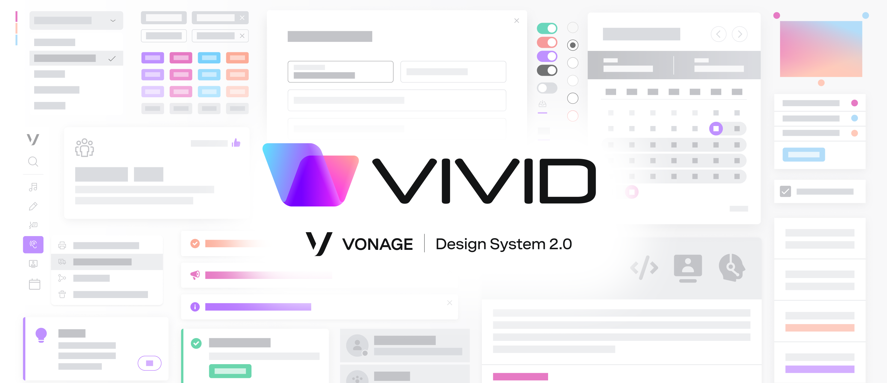

<p align="center">
  </img>
</p>

# Vivid UI components

### Get up and running
* Clone the repo
* Run `yarn install` in order to build the repo once / bring the dependencies
* Run the following steps as the normal build-and-see flow:
	* `yarn build` - builds `css` from `scss`, compiles `ts` into `js`
	* `yarn dev:server` - runs dev server on `localhost` in order to see the demo pages
	* OR `yarn start` - is a shortcut for `build` and `dev:server`, for your convenience
* Navigate to `https://localhost:5424/demos/index.html` (replace the port if needed) and start hacking with the components in the browser
* Welcome! :)

---

<p align="center">
  </img>
</p>

## Open-wc Starter App

[](https://github.com/open-wc)

## Quickstart

To get started:

```sh
npm init @open-wc
# requires node 10 & npm 6 or higher
```

## Scripts

- `start` runs your app for development, reloading on file changes
- `start:build` runs your app after it has been built using the build command
- `build` builds your app and outputs it in your `dist` directory
- `test` runs your test suite with Karma
- `lint` runs the linter for your project


## Issues

We use GitHub Issues as the official bug tracker for the **Liva Theme.** Please Search [existing issues](https://github.com/vonage/vivid/issues). It’s possible someone has already reported the same problem.

If your problem or idea is not addressed yet, [open a new issue](https://github.com/vonage/vivid/issues/new)
