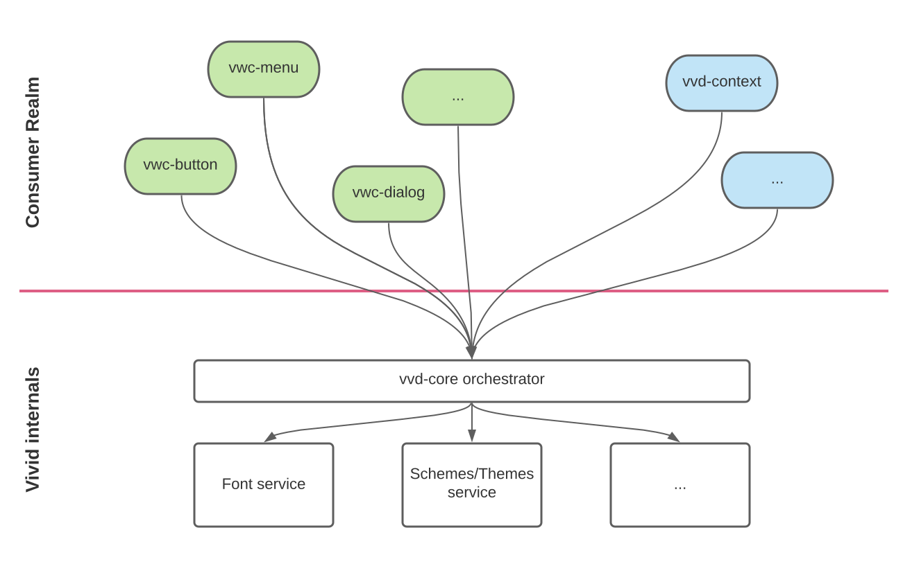

### Core - Vivid lifecycle

Vivid content may be consumed on different levels.
One may consume a single component, like `vwc-button`, `vwc-dialog` etc.
Another use might be to init a common context via `vvd-context` service to style a common HTML native semantics like `H1`, `p` etc.

Any of those involves internal mechanics initialization: fetching __fonts__ for typography, initializing __schemes__ for a theming / scheme management etc.
We call those __vivid core__.

There is a lifecycle here.
We've designed Vivid lifecycle to be self-contained, agnostic to other contexts and to not interfere nor require alignment to the existing application lifecycle or any other framework in place.

The chart below represents a general runtime initialization flow, while separating the system into the consumer-visible realm and the underlying platform.

Consumer realm's items are to be consumed by the hosting applications directly (API / imports etc). Below the line are the core parts of our system which are transparent to the consumer in vast majority of cases.



#### Initialization flavors

 __vivid core__ initialization may go 2 main paths:
- __auto-init__: this is the default behavior, Vivid will auto init itself upon the first usage unless specified otherwise
- __manual__: see below how to configure Vivid this way and when to use it

#### Readiness hook

In order to allow ourselves and consuming applications to run code __after__ initialization is done, __vivid core__ exposes a `settled` Promise. This Promise will resolve once all the __core__ services are done and ready.

> Important: in case of __manual__ initialization, `settled` will be immediately rejected.

```js
import vvdCore from '@vonage/vvd-core.js';

...

vvdCore.settled.then(() => {
	//	do whatever after the init, eg remove the loading "curtain"
});
```

Most obvious use of the `settled` is to remove the loading veil, which could be put over the site in order to prevent FOUC (flash of unstyled content).

#### Auto init

If consuming application took no special action, the first use of the Vivid's component/s will auto initialize the __vivid core__.

##### Default init

All the __vivid core__ services auto-initialize to default values if not specified otherwise.

##### Pre-configured init

In order to help Vivid to initialize itself to some specific state, consuming application should use `data-vvd-context` attribute on `html` element.
The below example will auto-initialize __vivid core__ with the dark theme.

```html
<html data-vvd-context="dark">
...
```

> Important: the attribute is being examined at the moment of initialization ONLY, so it should be in place BEFORE the initialization performed. We suggest using this feature as a purely static setup OOTB.

#### Manual init

Advanced consumer might like to manage the visual application state (we mean Vivid's part, eg theming) as per user setting.

This case would involve an async work to be done client side, eg fetching personalized settings from the server or from a local storage like IndexedDB.

Init with __none__ keyword designed exactly for that. It will prevent auto init of the __vivid core__. It can be done in the following manner:

Set the `data-vvd-context` to `none` in HTML:
```html
<html data-vvd-context="none">
...
```

Use the __vivid core__ API to set configuration dynamically:
```js
import vvdCore from '@vonage/vvd-core.js';

vividCore
	.set({
		scheme: 'dark'
	})
	.then(() => {
		//	do whatever after applying configuration
	});
```

Pay attention: `set` API is not limited to the init use case only, it may be used for any runtime (re-)configuration of the Vivid overlay.

> Reminder: `settled` Promise of the __vivid core__ is immediately rejected when __none__ initialization flavor is used.

## Optimize component rendering

Core is a dependency shared by all Vivid components and is responsible of mounting critical resources such as font, theming tokens etc.
By its esm nature Core might be discovered late in the page rendering process, therefore result in [FOUC](https://webkit.org/blog/66/the-fouc-problem/#:~:text=FOUC%20stands%20for%20Flash%20of,having%20any%20style%20information%20yet.&text=When%20a%20browser%20loads%20a,file%20from%20the%20Web%20site.).

```html
<link rel="preload" href="https://fonts.resources.vonage.com/fonts/v1/Spezia_Web_Complete_Upright.woff2" as="font" importance="high">
<link rel="preload" href="[_...path-to-resource_]/scheme.light.css.js" as="script" importance="high"> // conditional to author preferred (could be dark scheme)
```

Now that resources are highly prioritized, core should be prioritized as well to have them mounted in the application.

```html
<link rel="preload" href="[_...path-to-resource_]/vvd-core.js" as="script" importance="high">
```

Note that not all browsers fully support [priority hints](https://web.dev/priority-hints) at the time of this writing, but adding them can significantly enhance the experience in browsers that do.
