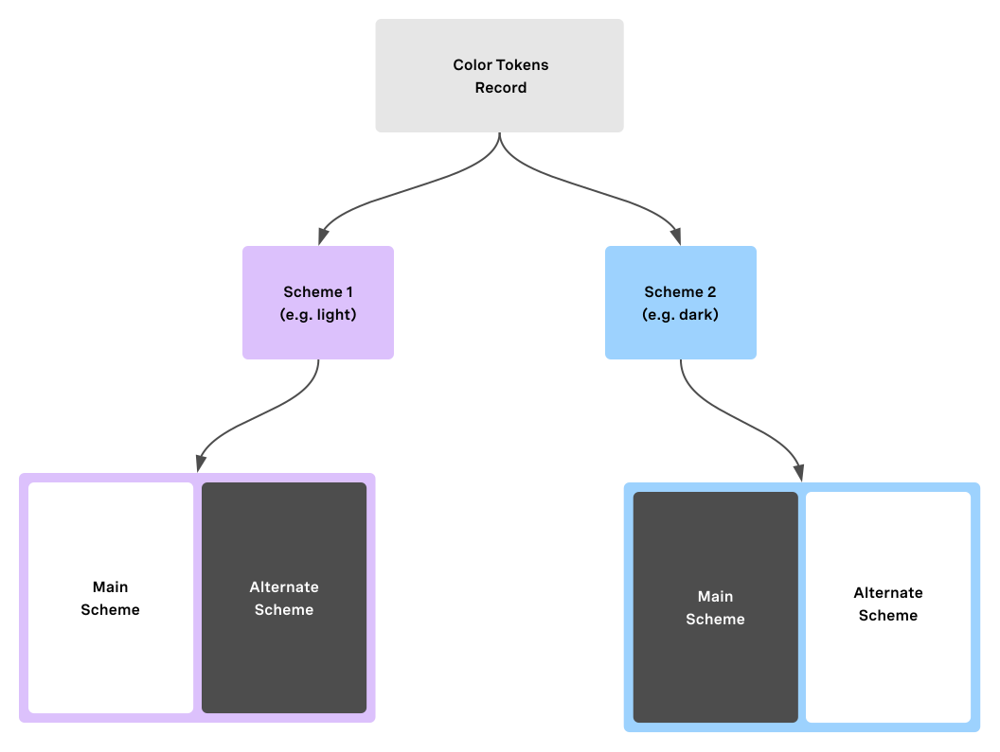

# Vivid Scheme

#### Scheme provides color context to Vivid components & applications. It is an integral part of packages, which are subject to the scheme's color tokens.


This package is imported and executed by default in all [core](/common/core) dependent packages but can also be [consumed on its own](#installation).
By default, (if not explicitly defined otherwise by the consumer) scheme will result in the user's preferred os option (***light***|***dark***|***auto***)
  
Each scheme will provide the same exact color tokens to support **main** context and its **alternating** - contrasting - context (e.g. sidenav, top-bar etc'...). Once imported and set, these tokens are reflected as CSS variables.



Scheme will apply **main** context on _body_ selector and will never apply **alternate** unless explicitly set.
To also be able to modify HTML scopes manually in apps, we include the following css selectors:
##### main
- `body`
- `.vvd-scheme-main`
- `::part(vvd-scheme-main)` - for elements within a shadow tree with a matching part attribute
##### alternate
- `.vvd-scheme-alternate`
- `::part(vvd-scheme-alternate)` - for elements within a shadow tree with a matching part attribute

## Installation

```bash
yarn add @vonage/vvd-scheme
```
or
```bash
npm i @vonage/vvd-scheme
```

## Consumption

```html
<script type="module" src="../node_modules/@vonage/scheme/vvd-scheme.js"></script>
```
or
```js
import scheme from '@vonage/vvd-scheme';
```

As colors are critical identities of our style, it's advised to include a [link type:modulepreload](https://developer.mozilla.org/en-US/docs/Web/HTML/Link_types/modulepreload) to hint the browser of the module importance, its high priority and preemptively fetch it.
```html
<script rel="modulepreload" src="../node_modules/@vonage/scheme/vvd-scheme.js"></script>
```

## Features:

| Name                    | Description |
|-------------------------|-------------|
| set                     | a method to set the scheme. options: _light_, _dark_, _syncWithOsSettings_ (defaults to _syncWithOsSettings_) |
| eventBus                | acts as **EventTarget** to polyfill the absence of element. can be hooked and callback upon selection - `eventBus.addEventListener('vvd-scheme-select', console.log);`  |
| getSelectedScheme       | get current applied scheme (_light_, _dark_)|
| getSelectedSchemeOption | get current option (_light_, _dark_, _syncWithOsSettings_) |


### Theme Switch

Scheme is nicely paired with the [vwc-theme-switch](/components/theme-switch) UI component that toggles the available options.
