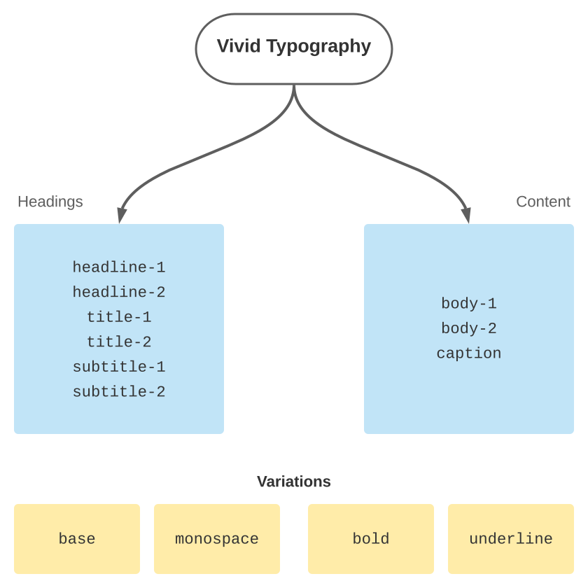
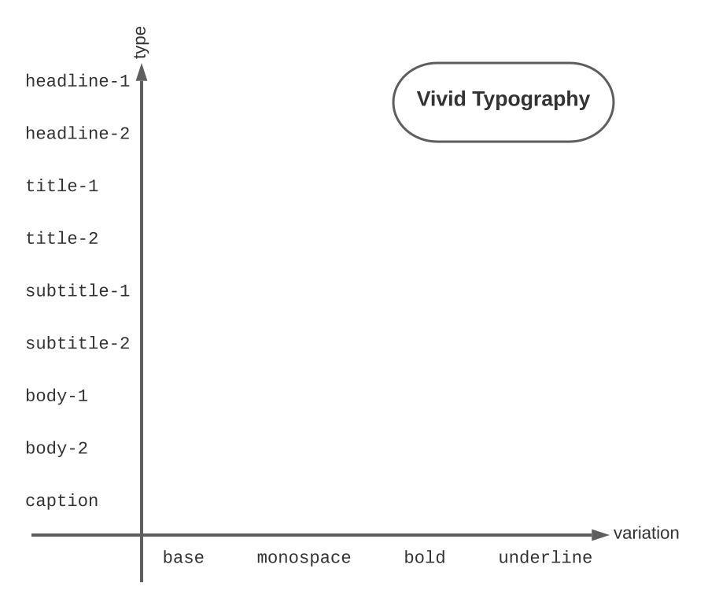

### Introduction

Vivid provides typography definitions as part of it's underlying design system.

In majority of cases consumer will have the typography set correctly either via the Vivid components or Vivid context, so nothing has to be done to get it be used.

### Types and Variations

Vivid typography is built from the **Spezia** font family, namely the regular one and the monospace one.

Vivid provides several typography **types**, all of which can be used in several **variations**.
Typography **type** refers to the principally distint set of parameters, most notably `font-size`, `font-weight` and `font-stretch`.

By **variation** term we mean either a base typography type taken as it is, or some specific deviation from it, most notably either in `font-weight` (bold variation), `font-family` (monospace) or `text-decoration` (underline).

Principal distinction between the **types** and the **variations** is, that **variation** may be applied to the 'current' type, without knowing much of it. This way we can achieve the following carthesian matrix of typography flavors:

#### Types

Vivid typography types are principally split into 2 categories: **Heading** and **Content**.

Heading part handles the typography types of headers.
There are 6 types in this category, corresponding to the 6 header elements in HTML specification.
Usage of these kinds of typographies is simple and straight forward - just putting the relevant header element (as specified by the designer :)

Content typographies comprised from 3 types: **Body 1**, **Body 2** and **Caption**.
In this case, too, the usage is bound to the components or the HTML context.

#### Variations

Be it heading line or regular paragraph text, we might need to style some of the words in a slightly deviating way.
Take for example the `code` element. The way this element deviates from the surrounding context is by usage of Monospaced font-family, while the rest of the typography attributes are staying the same.

These kinds of changes, most notably inline elements aspects, we call **variations**.
There are 4 variations in the Vivid design system as a whole:
* `base` - regularly used, default variation for each typography type
* `monospace` - monospaced variation is mostly used for the code snippets, keyboard sequences etc
* `bold` - this is for strong inline element and some of the components (button)
* `underline` - rarely used variation, used now for a link styling
