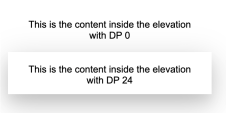

# vwc-elevation

## Introduction

The _elevation_ component enables a user to set perceived elevation to a certain level.

Note that this component is responsible for the perceived elevation alone and not to DOM elements z-indexing.


## Usage


```
<vwc-elevation dp="2"><div>Content</div></vwc-elevation>
```


## API

### Properties/Attributes

|name|attr/prop/reflected|type|description|
|--- |--- |--- |--- |
|dp|property/attribute|string|Level in Density-Independent Pixels (DP). Possible values: `2`,`4`,`8`,`12`,`16`,`24`|

### CSS Variables

|name|description|
|--- |--- |
|`--vvd-elevation-background-color`|Color for the elevation surface background (defaults to theme’s surface background)|
|`--vvd-elevation-border-radius`|Border radius of the elevation’s surface in pixels|

# Example:



Example’s code:

```
<vwc-elevation dp="24" border-radius="16">
   <vwc-button-toggle-group>
       <vwc-button label="Standard" layout="filled" type="submit" unelevated=""></vwc-button>
       <vwc-button label="Hybrid" layout="filled" type="submit" unelevated=""></vwc-button>
       <vwc-button label="Satellite" layout="filled" type="submit" unelevated="" selected="true"></vwc-button>
   </vwc-button-toggle-group>
</vwc-elevation>

<vwc-button-toggle-group border-radius="16">
   <vwc-button label="Standard" layout="filled" type="submit" unelevated=""></vwc-button>
   <vwc-button label="Hybrid" layout="filled" type="submit" unelevated=""></vwc-button>
   <vwc-button label="Satellite" layout="filled" type="submit" unelevated="" selected="true"></vwc-button>
</vwc-button-toggle-group>
```


