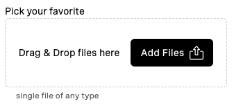

### `vwc-file-picker`

`vwc-file-picker` is a composite component that enables to perform files selection on from the users environment.

`vwc-file-picker` allows to pick files either by opening a file selection dialog of the operating system, or via drag'n'drop of the file onto the component's surface.

Example:
```html
<vwc-file-picker label="Avatar image" helper="select image of max 1Mb">
  <input type="file" name="some-file" />
</vwc-file-picker>
```

### Structure



`vwc-file-picker`'s structure is quite flexible and customizable.
In general we have the following particles:
- label, text to appear __above__ the component ('Pick your favorite' in the picture above)
- helper message, textual hint with optional error icon; located __below__ the component ('single file of any type' in the picture above)
- drag'n'drop surface (the dashed area in the picture above)
- drag'n'drop textual hint, which appears __centered within__ the surface ('Drag & Drop files here' in the picture above)
- button, triggering file input dialog 

The component structure can be simple to rich, as following list (in the ascending order of complexity):
- drag'n'drop surface only: only drag and drop files allowed here; can optionally add a textual hint via the `dd-hint` slot (see API slots section below):
	```html
	<vwc-file-picker label="Avatar image" helper="select image of max 1Mb">
		<p slot="dd-hint">Drop the amazing files here!</p>
		<input type="file" name="some-file" />
	</vwc-file-picker>
	```
- button only: providing a custom `vwc-button` via the `button` slot (see API slots section below) and disabling drop zone (see API properties section below); the button then triggers the file input operating system dialog:
	```html
	<vwc-file-picker label="Avatar image" helper="select image of max 1Mb" drop-zone="false">
		<vwc-button slot="button">Upload</vwc-button>
		<input type="file" name="some-file" />
	</vwc-file-picker>
	```
- drag'n'drop surface with button: this flavor has both, the drag'n'drop surface and the button; here, as well, the drag'n'drop hint text can be customized or removed:
	```html
	<vwc-file-picker label="Avatar image" helper="select image of max 1Mb">
		<vwc-button slot="button">Upload</vwc-button>
		<input type="file" name="some-file" />
	</vwc-file-picker>
	```

In addition to those major variations, there are the label and the helper message, mentioned above, which are customizable as well.

### API

#### Properties

| Property            | Attribute           | Type      | Default                      | Description                                                                                                                                    |
| ------------------- | ------------------- | --------- | ---------------------------- | ---------------------------------------------------------------------------------------------------------------------------------------------- |
| `label`             | `label`             | `string`  | `''`                         | label text, if any                                                                                                                             |
| `helper`            | `helper`            | `string`  | `''`                         | text to be shown in helper message in normal (non-errorneous) state                                                                            |
|                     | `drop-zone`         | `boolean` | `true`                       | attribute controlling whether the drop zone should be rendered or not                                                                          |
|                     | `no-counter`        | `boolean` | `false`                      | attribute controlling whether counter badge should be always hidden                                                                            |
| `validationMessage` | `validationmessage` | `string`  | `''`                         | text to be shown in helper message when component is in erroneous state, when empty, the component falls back to the default messages as below |
| `notAFileError`     | `notafileerror`     | `string`  | `'only file/s drop allowed'` | text to be shown specifically when drag'n'drop of not-a-file attempted                                                                         |
| `tooManyFilesError` | `toomanyfileserror` | `string`  | `'only one file allowed'`    | text to be shown specifically when multiple files droped while slotted input has no `multiple` attribute defined                               |

#### Slots

Most of the slots below are for the customization purposes, but one of them, `input-file-slot` is essential, required and is worthy a special treatment here.

Thus, `input-file-slot` requires provision of the `input` element (native) from the consumer.
This element MUST have `type="file"`.
This element MAY have `name`, `multiple` and `accept` attributes, all as specced out [here](https://developer.mozilla.org/en-US/docs/Web/HTML/Element/input/file).
Moreover, consumer will use this, his own provided input, in order to listen to `change` events and/or take the file/s when needed.

| Name              | Required | Description                                                                 |
| ----------------- | -------- | --------------------------------------------------------------------------- |
| `dd-hint`         |          | textual hint for the drag'n'drop component                                  |
| `button`          |          | button component to add to the components structure                         |
| `input-file-slot` | yes      | input element of type `file` that will be actually used as a file collector |

### CSS Custom Propertis

| Name                           | Default | Description                       |
| ------------------------------ | ------- | --------------------------------- |
| `--vvd-file-picker-min-height` | `140px` | minimum height of the file picker |
