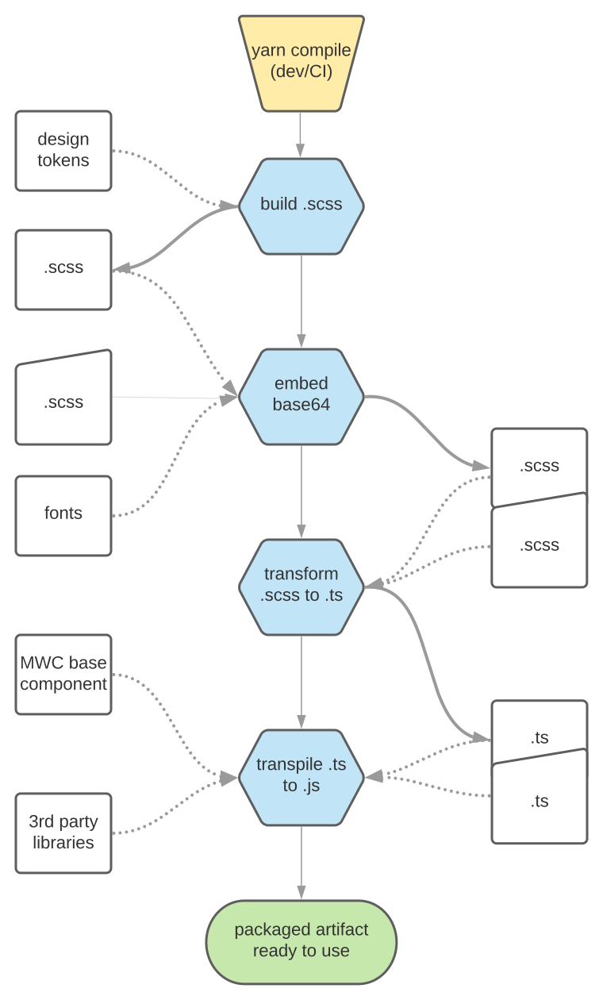

# Architecture

### Vivid Design System architecture

###### Providing Design System requires some architectural decisions to be set in place. This page dedicated to outline the most important ones, providing some reasoning wherever possible.

[Back to main page](../readme.md)

### What we deliver

Vivid's approach is mostly relies on the [Open-WC](https://open-wc.org/guide/) guidelines. As a such, we provide our products as a __web-components__, namely: components defined as custom elements, featuring templating, shadow DOM etc.

Some of those components are rather generic, 'atomic' ones, like button or text input. Others are complex, business-logic oriented micro-frontends. Yet, the design principle apply to all of them alike.

Beside the components which are actual DOM elements used on the page, we also provide a set of supporting or infra services, like schema management, fonts management and more.

---

### How it is packed

All of our packages are to be consumed by the end-using application as an __ES6 modules__.
There are some cases where additional provisioning exists, like pure CSS linking for the fonts import, but those are rather exceptional cases.

We are __not__ bundling/transpile our packages, as we believe that the final packing of the code, our own and our dependencies, is an end-using application concern:
* end-using applications mostly already have such a build process in place
* each end-using application may take a different approach to solve this task
* being 'open' from our side allows the end-using application to resolve any peer-dependencies conflicts, be it Vivid's dependencies or app's own ones, correctly and in one place
* this is the optimal way to deliver minimal required code, that is actually used in application

---

### Compatibility

Our product written mostly in __TS__/__SCSS__. When shipping the code we __do__ transpile it into __JS__/__CSS__, where the target format is __ES6__.

Any modern browser is capable of running our code as-is.
This is a 'buildless' approach, advocated by Open-WC, among others.
Yet, it also means that our products __require__ an additional transpilation in order to run on an older browsers, such as IE11.

End-using application may and most likely will perform build steps of its own choice. That is the place, where any final adjustments of our packages and their dependencies should take place, be it transpilation, bundling, minification or else, all this along with the end-using application's own code.

---

### Where we host things

Vivid components are published to a GitHub packages.
Consuming our modules is similar to that of a regular NPM dependencies, for any GitHub packages specifics please refer to [this documentation](https://help.github.com/en/packages/using-github-packages-with-your-projects-ecosystem/configuring-npm-for-use-with-github-packages).

Further down the way we will be considering to provide all/some of our deliveries from a CDN, in which case this documentation will be updated correspondingly.

---

### Vivid components under the hood

We adopted [MWC components](https://github.com/material-components/material-components-web-components) as our prototype and are extending the team's core components, which in turn based upon [MDC vanilla components](https://github.com/material-components/material-components-web).

At the very core, we are targeted to provide a generic, framework agnostic components focused each on its own well-defined functional requirement.

In the future we may consider providing a (hopefully) thin binding layer for frameworks, that are not capable of managing web-components in their native form.

Below is the chart, that roughly outlines the source code transformations from the white list, via the productized Vivid packages, to the end-using application (common case):

Higher level flow, CI/CD perspective of the things is motion, is outlined in the [Dev/Ops process documentation](https://github.com/Vonage/vivid/blob/master/docs/dev-ops-process.md).