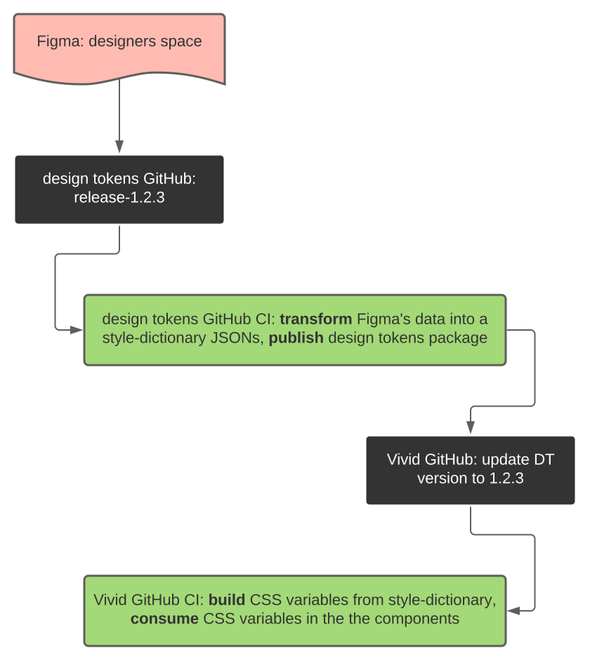

# From designer table to production - automating the process

Vivid project delivers components and services based on a unique Vonage Design System.
The development process includes incorporation of a designers artwork materials (palette, semantic colors, typography, shape definitions and many more) into the living code, which is being then built, tested and released as a ready-to-use packages.

Due to a well-known complexities in mediation between those two - artboards of designers and code of programmers, we decided to automate the whole process as much as possible, leaving the most critical points where human intervention required to be the only manual steps.

The flow, roughly, goes as following:
* [manual] designers are working in Figma tool on the new content
* [manual] when content is ready - one of a team triggers release of a new design-tokens package
* [CI] design-tokens automation:
	* **E**xtracts the data from Figma
	* **T**ransforms it into the style dictionary JSONs
	* **L**oads them as part of the repo sources
	* finally, publishes a new version of the package
* [manual] Vivid's engineer updates design-tokens dependency to a new version
* [CI] Vivid automation:
	* **E**xtracts the relevant parts of the dictionaries
	* **T**ransforms the data into a CSS variables (delivered as SCSS stylesheets)
	* **L**oads those variables as part of it's services/components
	* the above process is repeated for several aspects, each in its own package: scheme, typography etc
	* services/components are built, tested and published to be used in the consuming web applications

## Full flow visualization

Chart below visualizes the Vivid's implementaton of design tokens incorporation into the living code flow.

