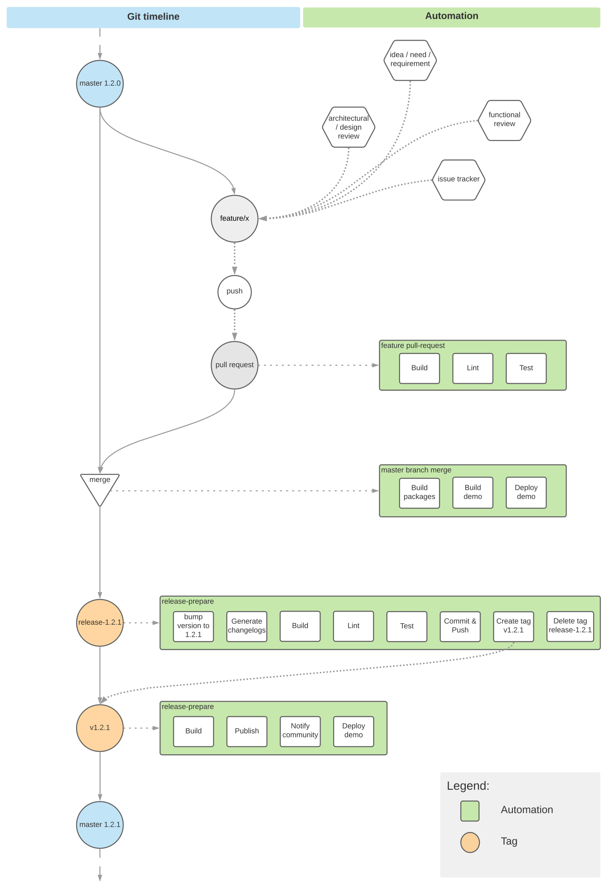

# Plan-Code-Build-Deliver process

In order to build, test and deploy our product we use [GitHub actions](https://help.github.com/en/actions), aka workflows.
Most of the routine tasks are automated, leaving only the actual release part (including versioning) manual, as of now.

Most of the processes may and should be run locally to save the time and the resouces of both the developer/contributor self and the CI system.

## Process flow

Our code is stored and managed with Git, hosted in GitHub.

We follow a CI/CD approach as below:
* `master` is our main (default) working branch receiving content from a feature branches
* custom 'feature branches' are created from `master` upon each new feature/functionality development and are merged back into it upon finalization via Pull Requests
* when release is to be published:
  * __human__ manually creates a tag (named `release-<version>`, for example `release-0.5.2`) on the `master` branch
  * __CI__ runs the following steps (in 2 pipelines):
    * bump the version as specified
    * generate changelog
    * build and test packages
    * commit and push the bumped versions
    * create tag named `v<version>` (following the example above `v0.5.2`)
    * publish the packages
    * build & deploy the [__release demo site__](https://vivid.vonage.com)

## Quality

Quality of the code is insured by the following means:
* static code analysis, linting (`eslint`)
* unit/functional tests (`karma`)
* coverage (`istanbul`) - currently, thresholds are not enforced

Opening Pull Request to the `master` branch will run the quality validating CI cycle:
* code build/compile
* lint
* test
> Subsequent pushes to that PR will run the CI as well.

Only a green PRs will be merged!
Merging PR into the `master` has a 'side effect' of new [__dev demo site__](https://dev.vivid.vonage.com/) being built & deployed, enabling to review/show-off our new features/components in pre-release phase.

## Full flow visualization

Chart below visualizes the Vivid's dev flow for a single feature plan-to-release cycle.

