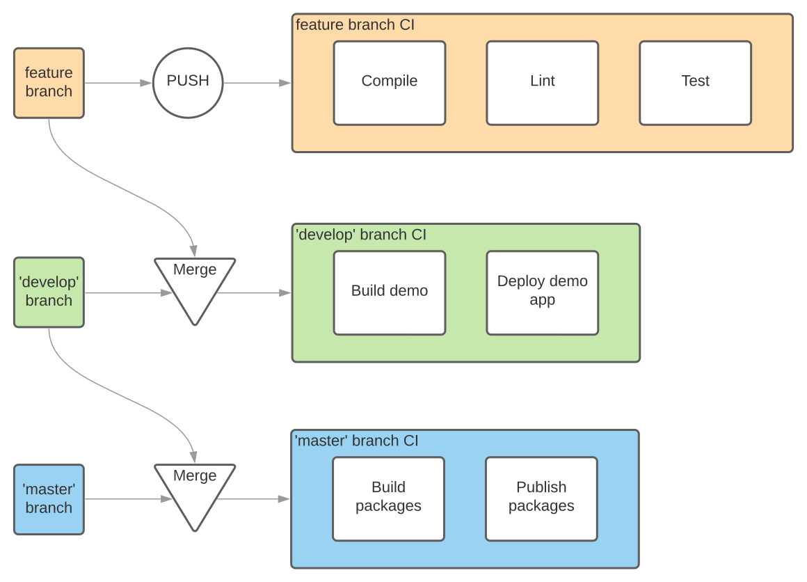

# Dev/Build process

In order to build, test and deploy our product we use [GitHub actions](https://help.github.com/en/actions), aka workflows.

Most of the processes may and should be run locally to save the time and the resouces of both the developer/contributor self and the CI.

##### Git flow

Our code is stored and managed by Git, hosted in GitHub.

We apply a Git flow approach, as it outlined, for example, [here](https://www.atlassian.com/git/tutorials/comparing-workflows/gitflow-workflow):
* `develop` is our main (default) working branch receiving content from a feature branches and upstreaming it to the master as per release
* custom 'feature branches' are created from `develop` upon each new feature/functionality development and are merged back into it upon finalization via Pull Requests
	* non-inter-organizational contributors should __fork__ the repo/branch and work on their fork
* `master` branch is used to hold a releases points of code, that is merged into it from the `develop` branch only (or hotfixes in exceptional cases)

##### Quality

Quality of the code is insured by the following means:
* static code analysis, linting (`eslint`)
* tests (`karma`)
* coverage (`istanbul`) - currently not enforced

Each `push` of the code to any branch but special ones, see below, will execute the following set of actions:
* lint
* code build/compile
* test

Finalized feature branches should open Pull Request to the `develop` branch. Only a 'green' PRs will be merged.

Upon PR merge, `develop` branch won't run the quality checks, but will do its own deploy.

Further, when the content of release is closed, `develop` branch will PR to the `master` - this process is internal to Vivid team and mostly transparent to the rest of the contributors.

Upon PR merge, `master` branch won't run the quality checks, but will do its own deploy.

##### Deploy

`develop` branch is responsible for deploying the __Demo__ application (may change in the future).

`master` branch is responsible for deploying the packages - publishing.

Chart below is a rough representation of the Vivid's DevOps flow.

