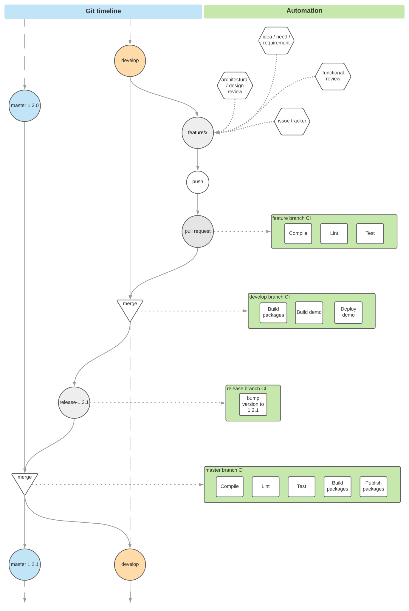

# Plan-Code-Build-Deliver process

In order to build, test and deploy our product we use [GitHub actions](https://help.github.com/en/actions), aka workflows.
Most of the routine tasks are automated, leaving only the 

Most of the processes may and should be run locally to save the time and the resouces of both the developer/contributor self and the CI system.

##### Git flow

Our code is stored and managed with Git, hosted in GitHub.

We apply a Git flow approach, as it outlined, for example, [here](https://www.atlassian.com/git/tutorials/comparing-workflows/gitflow-workflow):
* `develop` is our main (default) working branch receiving content from a feature branches and upstreaming it to the master as per release
* custom 'feature branches' are created from `develop` upon each new feature/functionality development and are merged back into it upon finalization via Pull Requests
	* non-inner-organizational contributors are welcome to __fork__
* when we decide to cut the release, we open a release branch (named `release-<version>`, for example `release-0.5.2`) from `develop`
* release branch is pushed and running some automation, then PRed and merged to the `master`
* `master` branch, once received a merge from the `release-x`, publishes the packages

##### Quality

Quality of the code is insured by the following means:
* static code analysis, linting (`eslint`)
* tests (`karma`)
* coverage (`istanbul`) - currently not enforced

Each `push` of the code to any branch but special ones, see below, will execute the following set of actions:
* lint
* code build/compile
* test

Finalized feature branches should open Pull Request to the `develop` branch. Only a 'green' PRs will be merged.

Upon PR merge, `develop` branch won't run the quality checks, but will do its own deploy.

Further, when the content of release is closed, `develop` branch will PR to the `master` - this process is internal to Vivid team and mostly transparent to the rest of the contributors.

Upon PR merge, `master` branch won't run the quality checks, but will do its own deploy.

##### Full flow visualization

Chart below serves as a visualization of the Vivid's dev cycle flow.

