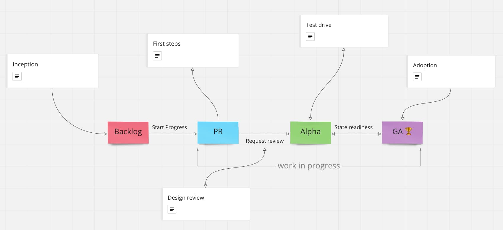

# Inception
### How contributions are born and decided upon
Packages roadmap is feedback driven. meaning it is composed by requirements and relevance to Vonage LOBs.
We gather "field" information, process the complexity against mutual needs and set the course to delivery.
Requirements can be raised & discussed throughout the following channels and methods:
- [Repo discussions](https://github.com/Vonage/vivid/discussions)
- [Vivid on Jira](https://jira.vonage.com/secure/RapidBoard.jspa?rapidView=1220&projectKey=VIV&view=detail&selectedIssue=VIV-493)
- Slack channels: #ask-vivid / #vivid-engineering
- Bi-monthly sync talks
- [Airtable](https://airtable.com/shrwoX0oK31iAjq3N)
- [Design process](design-develop-process.md)

P.S. We're also bound to support **UI Kit 1.0** (Volta) **parity** as **primary objective**

# Pull requests

Coordinate expectations and provide a POC as follows:

1. Draft document will be created as a [GitHub discussion](https://github.com/Vonage/vivid/discussions/732) and should contain proposed API and user stories
2. A notification / meeting will be set with relevant participants (Vivid team & LOB assigned ambassadors) to discuss and brainstorm the draft of specification
3. Document will be shared with attendees no less than 24 hours prior the meeting
4. From that point on a contribution is in development state and can be set to 1 of the WIP statuses (*pr*, *alpha*, *ga*)

A period of 2 weeks (full sprint) should enable all LOBs to take part in discussions on API / style / behavior or any other aspect of major **public** contribution
**Preview channel** should be available in the contribution **pull request** for all to review
# Design review
### Pre alpha state review

Once development is considered as done by contributor, the following should be inspected

- **1st and foremost** - [Vonage UI Kit 1.0](https://www.figma.com/file/kySd5ohfU2yaVGMdlhIpOm/Vonage-UI-Kit-1.0?node-id=8877%3A508) **Figma** design parity (Volta). note that any discrepancies from the figma to css Volta library will not be picked up by Vivid
- We put consumers' priorities 1st and willing to apply design parity modifications if requested & approved (by all LOBs)
- Unit & coverage tests
- Vulnerabilities
- A11y requirements match
- Code standards
- Design requirements match

# Test drive

**Alpha** phase helps expose a contribution and enable its availability to consume in apps

- New packages are required to be set as **Alpha** status when initially merged to master
- It should allow 1 month (2 sprints) for LOBs to test and **validate its readiness**
- It is recommended to have at least 1 LOB's app integration and make it to actual production environment during that time period
- If no major concerns raised by LOBs during that time, contribution can be **considered as stable**, production ready and set to **GA** status

# GA 🏆
### Adoption

Production ready contributions should be **integrated** in all LOBs

We consider any software lifecycle to be a fraction of a WIP and so does **GA**. this means **maintenance** still apply and issues are still addressed

###### Diagram can be viewed at https://miro.com/welcomeonboard/3gtGehDg6xUKP5l2d6JsScnVJ44S6u2k5F19dsPbXrcT4Lnp0kyKnnolaFg2Gs1Q