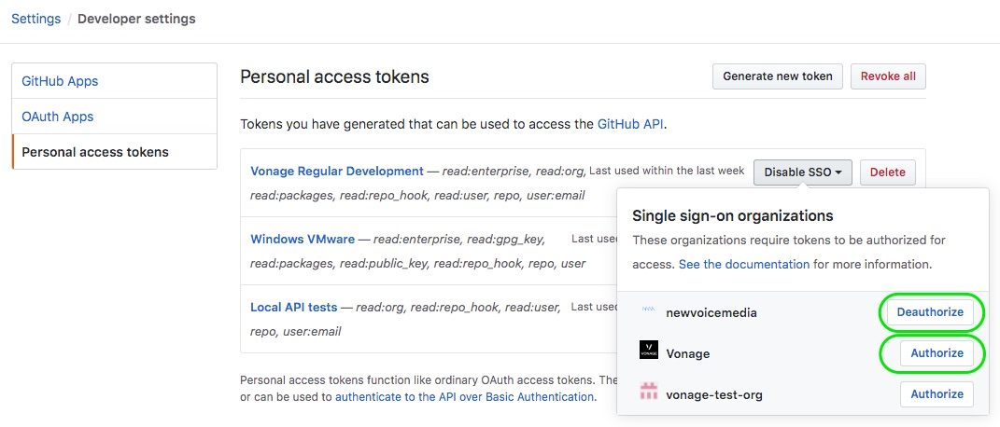

# How To Consume Vivid NPM Packages

Vivid packages are internal to Vonage organisation and are served from a secured and private registry - GitHub packages. This document describes how to consume packages as a developer and also offers guidance for automation admins.

- [Consuming NPM packages directly from GitHub](#consuming-npm-packages-directly-from-github)
- [Consuming packages from your internal packages source](#consuming-packages-from-your-internal-packages-source)
- [Adjusting your GitHub personal access token](#adjusting-your-github-personal-access-token)

## Consuming NPM packages directly from GitHub

> This is the most **basic solution**: the developer consumer internal packages from Vonage and all other packages are pulled directly from NPMJS.org.

_.npmrc_ example committed on each project that consumes Vivid packages:

```javascript
ca=null
always-auth=true

; Vonage (GitHub packages)
registry = https://npm.pkg.github.com/Vonage
_authToken = ${GITHUB_ACCESS_TOKEN}
```

> Developers must set `GITHUB_ACCESS_TOKEN` environment variable and be aware of access token configuration. See [Adjusting your GitHub personal access token](#adjusting-your-github-personal-access-token) below.

Installing a VIVID package:

```shell
$ npm install @vonage/vvd-scheme
npm WARN vivid-help No description
npm WARN vivid-help No repository field.
npm WARN vivid-help No README data
npm WARN vivid-help No license field.

+ @vonage/vvd-scheme@0.0.9-alpha.0
added 34 packages from 27 contributors in 6.637s

1 package is looking for funding
  run `npm fund` for details
```

## Consuming packages from your internal packages source

> This is the **recommended way** to consume any package dependencies: developer consumes all packages from secured internally accessed registry. Internal packages are available and public packages are scanned and cached at the secure source (vulnerability and license scanning is offered).

In the case your teams already make use of an internal package source (Artifactoruy, Snyk, etc) you can simply proxy/cache Vivid packages and your developers don't need to add any other configuration to consume packages.

Requirements:

> Assuming that Vonage has an automation GitHub user for Vivid project. This is managed by Vivid Team and GitHub Governance.

1. Issue a personal access token name similar to a regular user. See [Adjusting your GitHub personal access token](#adjusting-your-github-personal-access-token)
1. Describe the token like `<Org/team name> NPM package manager`
1. Share the access details with the automation team proceeding with the configuration:
   1. Username will be `vonage`
   2. Token will be the one generated
   3. Ensure it's shared securely (don't use email with the actual token, for example use [](https://onetimesecret.com)/)
   4. Responsible automation team should store their secret on LastPass or equivalent (based on the established procedures)

Example for CCaaS _.npmrc_ for this configuration (using Artifactory):

```javascript
ca=null
always-auth=true

; Artifactory (internal packages and public NPMJS.org)
registry = https://vonagecc.jfrog.io/vonagecc/api/npm/npm/
_auth = ${ARTIFACTORY_NPM_TOKEN}
email = ${ARTIFACTORY_USER}

```

## Adjusting your GitHub personal access token

> Don't have one?

Enable `repo` and `read:packages` scopes and don't forget to enable SSO for your tokens:



> **Attention:** You need to authorise as well for **Vonage** GitHub org in the case you haven't so far. If Vonage org now showing up please reach out `#ask-github` Slack channel and request access.
