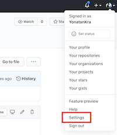
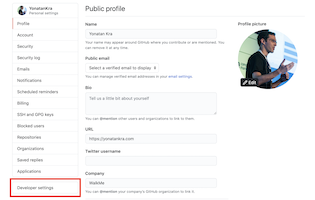

# Generating a token 
Follow the following guide to generate a token:
1. Login to github
2. Go to settings:        

3. Select `Developer settings`:   

4. Select `Personal access tokens`
5. Select `Generate new token`
6. Confirm your password
7. Type in a name for the tokn (e.g. Vonage Token)
8. Check all the checkboxes for permissions
9. Generate the token (the green button at the bottom of the checkboxes list)
10. Once the token is generated, copy it to someplace safe
11. In the line of the token select enable SSO:         

You can watch the video here:

