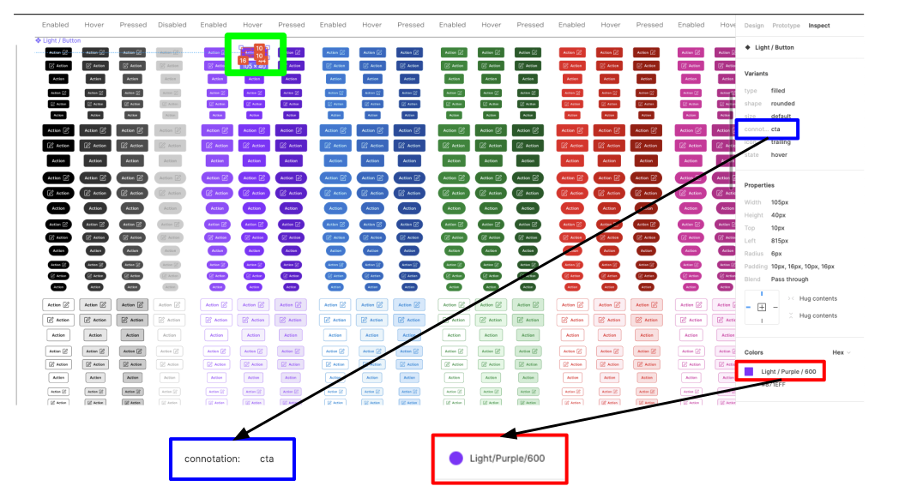
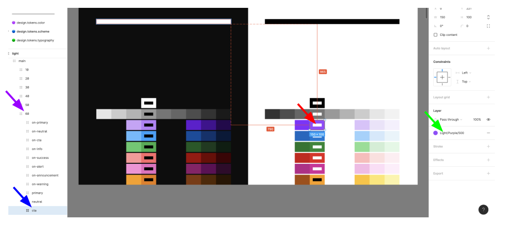

# Vivid Design Variables

The Vivid Design Variables system (ViDeV), is a way to translate css properties into meaningful variable names and set conventions to uphold.


## System and Process Diagram


## 


## Usage


### Get the wanted color from Figma: 


<table>
  <tr>
   <td>


   </td>
  </tr>
  <tr>
   <td>An example of colors in Figma. The selected button-icon in Figma (green rectangle at the top) shows its background color (red rectangle) and connotation (blue rectangle) in the right panel. In this case, it is <em>light-purple-600 </em>and <em>cta</em>.
   </td>
  </tr>
</table>


Then, we should head over to the Pallete page to find the right color. Right now in order to map concrete color (palette) to semantic color (scheme) you can refer to this Figma link: [https://www.figma.com/file/r8OYLPmRmDqfLKt6KHdJDB/Vonage-UI-Kit---2.0?node-id=1487%3A219](https://www.figma.com/file/r8OYLPmRmDqfLKt6KHdJDB/Vonage-UI-Kit---2.0?node-id=1487%3A219)

On this page,


<table>
  <tr>
   <td>



   </td>
  </tr>
  <tr>
   <td>In the Pallete screen we can click on a color (red arrow) and see the color’s definition (green arrow) as we see in the design. On the left panel, we can see the values used to create the CSS variable - `cta` (blue arrow) and the intensity 60 (purple arrow).
   </td>
  </tr>
</table>


In the image above, we can see an example of a color that can be used by a designer.  So now we know the color we need is `cta-60`.

We’ll be working on providing a more accessible table in the future.


### Find the CSS and SASS variables

From the color we found in Figma, we can construct the CSS variable or the SASS variable.

Let’s assume the color from the design matches `warning-20`. That means the CSS variable will be:


```
--vvd-color-warning-20
```


The SASS variable will be:


```
$vvd-color-warning-20
```


#### Theme Support

Vivid has theme support via CSS variables.  For instance, we have `on-base` as well as `base` colors along with `primary and `on-primary` colors.  This allows developers to set the style once, and just by using a theme, have the colors change accordingly.


#### Usage of the Variables

In the following example, the css variables are being used in order to set the correct color:


```
::slotted(#{vwc-button}) {
	--mdc-theme-primary: var(#{scheme-variables.$vvd-color-neutral-30});
	--mdc-theme-on-primary: var(#{scheme-variables.$vvd-color-on-base});
	--mdc-ripple-color: var(#{scheme-variables.$vvd-color-on-base});
	--mdc-ripple-focus-opacity: 0;
}

:host([accent]) {
	::slotted(#{vwc-button}[selected]) {
		--mdc-theme-primary: var(#{scheme-variables.$vvd-color-primary});
		--mdc-theme-on-primary: var(#{scheme-variables.$vvd-color-on-primary});
	}

	::slotted(#{vwc-button}:hover:not([selected])) {
		--mdc-theme-primary: var(#{scheme-variables.$vvd-color-neutral-50});
	}
}
```


In the example above, we set the colors of a slotted  `vwc-button` to be of color `neutral-30`.  The on color is set using the `$vvd-color-on-base`.  That means that the color will change when we change the theme.

In the `accent` part, we set a different background color using the `primary` color variable. When changing the theme, it will automatically take the `inverse` color.

See the image below for the example:


### Finding color connotations

In some cases, you’d want to use `color connotations`. In this case, you can find the right semantics in the code. Here are two examples to show how this works:


If we need a connotation _cta _with intensity _60,_ we will just pick: _$vvd-color-connotation _(which is the default or main color).

If we need a connotation cta with intensity 20, we will pick: _$vvd-color-connotation-soft _as it is mapped to `cta-20`.

If there’s a missing combination, the SCSS build will throw. This means that we need to add it to the configuration above (in the file: common/foundation/scss/mixins/color-connotation/_color-connotation-main.mixin.scss


### Using the SASS variables

Now that we understand how to select the right variable, using it in our component should be easy. For linting purposes, it is better to use the SASS variables given by the `color-connotation` and `scheme-variables`. Here’s an example:


```
@use '@vonage/vvd-design-tokens/build/scss/semantic-variables/scheme-variables' as scheme-variables;

@use '@vonage/vvd-foundation/scss/mixins/color-connotation/variables' as connotation-variables;

@include color-connotation.connotations-shades;
@include color-connotation.connotations-shades-default(primary);

::slotted([group-button]) {
  --mdc-theme-on-primary: var(#{scheme-variables.$vvd-color-on-base});
  --mdc-theme-primary: var(#{color-connotation.$vvd-color-connotation-soft});
}

```


Notice the @use and @include calls which expose the variables we need. Then the usage as `color-connotation.$vvd-color-connontation-soft` and `scheme-variables.$vvd-color-on-base`.


### Use the correct variable in a component


#### Conditional usage of a variable

Your component might have multiple states that require using a different value.


#### Adding a variable for a component (button/icon button example)

This can be achieved using the `@each` SASS command as follows:


```
$scopes: button icon-button; // define the states

@each $scope in $scopes {
  ::slotted(vwc-#{$scope}) {
   --vvd-#{$scope}-background-color: var(#{color-connotation.$vvd-color-connotation-soft});
   --vvd-#{$scope}-color: var(#{scheme-variables.$vvd-color-on-base});
   --vvd-#{$scope}-shape: var(#{$vvd-button-toggle-group-shape});
  }
}

```


Notice the usage of each `$scope` in the styling itself. Variables like:


####  `--vvd-#{$scope}-background-color`

are added in the sub component itself as an API.

For instance, in the `icon-button` there’s this line for a background API: \


```
background-color: var(--vvd-icon-button-background-color);
```
