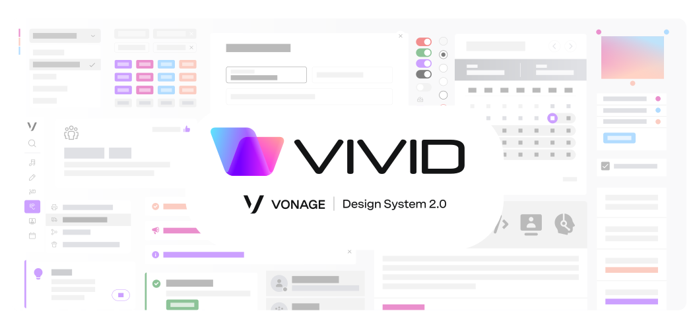

# Meet VIVID,

### Vonage's design system

###### Vivid provides components and tools to help product teams work more efficiently, deliver faster and safer, while providing end-users single Vonage unique look & feel.

Vivid delivers a Design System built along Vonage's branding guidelines - all this by providing a ready-to-use web components and services.

Striving to stick to the best practices and most up to date standards, Vivid's goal is to provide high quality, easy to use, well-maintained and well documented UI platform for all Vonage products.

---

### Documentation

For your convenience, we've organized all our documentation under the following topics.

#### Introductory

* [Getting started](docs/getting-started.md)
* [Architecture](docs/architecture.md)
* [Roadmap](docs/roadmap.md)
* [Contact us](docs/contact-us.md)

#### Guides

* [Installation](docs/installation.md)
* [Contribution](docs/contribution.md)
